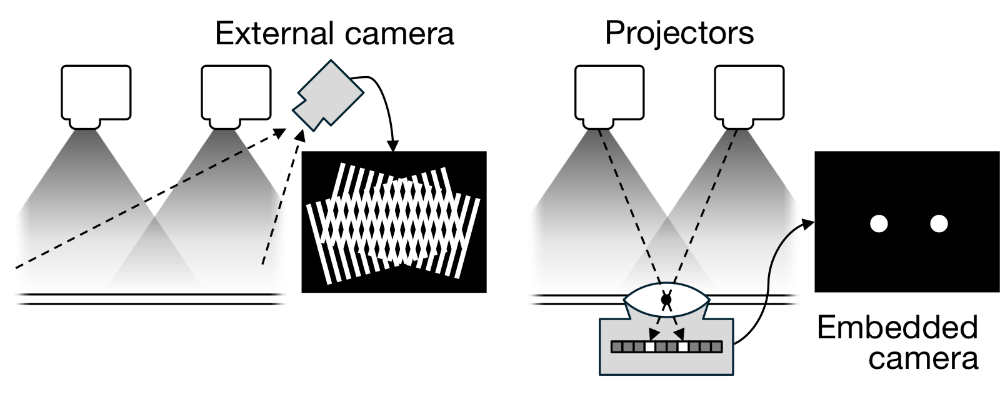
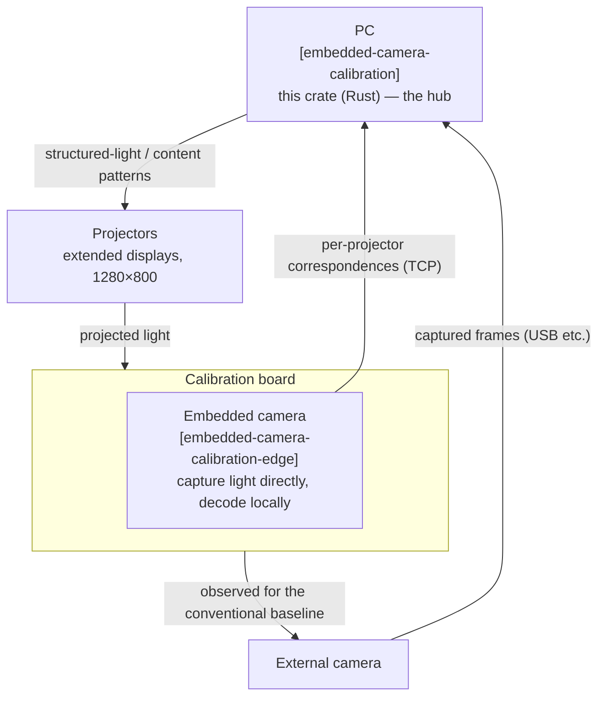
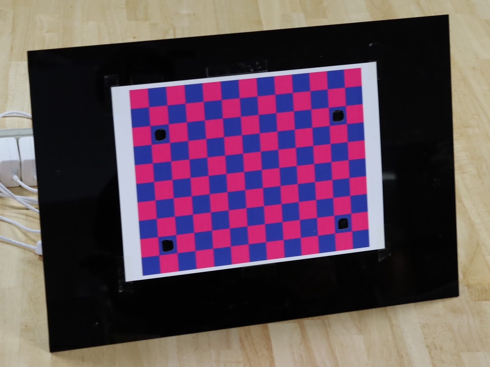

# embedded-camera-calibration

Rust implementation of the geometric calibration pipeline from
[*"Breaking the Scalability Limit of Multi-Projector Calibration with Embedded
Cameras"*](https://cvpr.thecvf.com/virtual/2026/oral/40265) (CVPR 2026, oral) by
Takumi Kawano, Kohei Miura, and Daisuke Iwai (Osaka University).

Cameras embedded in the calibration board observe structured light projected
**simultaneously** by many projectors. Each camera separates and decodes the
overlapping patterns locally, so the number of projected patterns no longer
grows with the number of projectors — removing the scalability limit of
conventional sequential calibration. This crate is the central host that drives
the projectors, orchestrates the embedded cameras, decodes the correspondences,
and estimates the per-projector geometry.

> Status: research code, released for reference. It targets a specific hardware
> prototype (embedded-camera board, projectors, external camera) and is **not
> runnable from this repository alone** — see [Hardware & prerequisites](#hardware--prerequisites).

## System architecture

<div align="center">

</div>

This crate is the hub of a three-part system. It projects structured light
through the projectors onto the calibration board; the cameras embedded in the
board observe the patterns and stream decoded correspondences back, while an
external camera observes the board for the conventional baseline.



- **Embedded cameras** ([`embedded-camera-calibration-edge`](https://github.com/tk-flourish/embedded-camera-calibration-edge)):
  runs on each embedded camera (Raspberry Pi), captures the projected structured
  light, and decodes per-projector correspondences locally. This crate talks to those servers over TCP (default
  `192.168.0.101–104:58919`). This is what makes calibration scale: all
  projectors emit at once and each camera demultiplexes them on-device.
- **External camera**: captured via OpenCV `VideoCapture`. It is used only for
  the conventional (external-camera) baseline and the optical-center
  compensation — the proposed method relies on the embedded cameras alone. The
  experiments used a tethered Canon DSLR; that proprietary backend is not
  included here, but the exposure settings used are kept in the code (see the
  `external_camera` module) as a record of the capture conditions.
- **Projectors**: driven as extended displays at 1280×800; this crate renders
  the structured-light and content patterns fullscreen on each.

## Repository layout

### Library (`src/`)

| module | role |
|---|---|
| `calibrator` | the hub: time-synchronised structured-light projection/capture and decoding |
| `camera` | TCP client for the embedded-camera servers |
| `camera_mesh` | load the optical-center compensation mesh |
| `external_calibrator` | optical-center compensation + external-camera checkerboard acquisition |
| `external_camera` | external-camera abstraction (OpenCV `VideoCapture`) |
| `content_projection` | project content onto the board via the estimated homographies |
| `calibration_evaluator` | reprojection-error evaluation, plots, JSON output |
| `projection` / `patterns` / `debug_viz` | projector windows, pattern generation, debug overlays |
| `types` | shared types |

### Binaries (`src/bin/`)

The binaries drive the rig and reproduce the paper's experiments; see
[Running the binaries](#running-the-binaries) for each one's prerequisites,
inputs, and outputs.

## Building

Requirements:

- A recent Rust toolchain.
- **OpenCV** (native library) and **libclang** (used by the `opencv` crate to
  generate bindings).

Windows: install OpenCV via vcpkg and set `VCPKG_ROOT` (and `VCPKGRS_DYNAMIC=1`)
in your environment, as described in the [`opencv` crate docs](https://github.com/twistedfall/opencv-rust), then `cargo build`.

macOS: install OpenCV with `brew install opencv`, point `PKG_CONFIG_PATH` at its
`pkgconfig` directory and `LIBCLANG_PATH` at your libclang install, then `cargo build`.

Linux: install OpenCV and `libclang` via your package manager, then `cargo build`.

## Hardware & prerequisites

<div align="center">

</div>

Building always works (see above), but **running** any binary requires the
physical prototype — there is no recorded dataset or simulator in this
repository.

### Required hardware

- the embedded-camera calibration board — an acrylic plate with four Raspberry Pi
  Camera Module 3 Wide cameras (their layout is not fixed; positions are supplied
  via `--camera-positions`, see [Embedded-camera positions](#embedded-camera-positions)) — with the
  **edge-agent** (`embedded-camera-calibration-edge`) servers reachable on the LAN
  (the prototype's `192.168.0.101–104:58919` are the defaults; override per binary with `--cameras <host:port> …`);
- the projectors connected as extended displays, each 1280×800 (hardcoded),
  arranged in a single horizontal row immediately to the right of the primary
  display in projector-id order (primary | projector 0 | projector 1 | …): the
  window for projector *id* is placed full-screen at *x* = (primary display
  width) + *id* × 1280, *y* = 0;
- an external camera (a generic UVC camera via OpenCV; the experiments used a
  Canon EOS RP) — needed by every binary except `capture_all`;
- the optical-center compensation mesh `.data/camera_mesh.json`, produced by
  `prepare_camera_mesh` and required by every binary except `capture_all`.

### Coordinate frame

All board coordinates use the **checkerboard coordinate frame**: the origin is
the first corner and the unit is millimetres. The checkerboard is configurable
(`--checker-cols`/`--checker-rows`/`--square-size-mm`, defaults 12/9/20 mm); the
prototype's 12×9-inner-corner, 20 mm board spans 220×160 mm, which is exactly the
default content canvas in `content_projection`. The content canvas/region is
configurable via `--canvas-width-mm`/`--canvas-height-mm` and
`--content-x-start-mm`/`--content-x-end-mm`/`--content-y-start-mm` (defaults
220×160 mm, content X 20–200 mm — the prototype rig); the `--camera-positions`
below are expressed in this same frame.
The printed checkerboard is blue/magenta, so the external camera reads corners
from its red channel and the projected patterns from its blue channel.

### Embedded-camera positions

The **embedded-camera positions** on the board are *not* hardcoded — the
evaluation binaries take them via `--camera-positions` (used for the uncorrected
baseline). The prototype's values, in this frame (mm) and in camera-id order, are:

```
--camera-positions 211.32,32.64 10.79,31.93 210.00,150.99 10.54,150.73
```

Measure and substitute your own rig's values when reproducing on different hardware.

## Running the binaries

The binaries drive the prototype rig (see
[Hardware & prerequisites](#hardware--prerequisites)) and reproduce the paper's
experiments; each subsection notes the paper section it covers.

Run `prepare_camera_mesh` first; the other binaries consume the
`.data/camera_mesh.json` it produces.

### `prepare_camera_mesh` — §4.1 (compensation mesh)

Builds the optical-center compensation mesh. The board stays fixed while a single
projector is physically repositioned; each capture pairs a projector point with
the observing camera's effective board position.

- **Drives:** 4 embedded cameras + 1 projector (moved between captures) + external camera.
- **Inputs:** none.
- **Output:** `.data/camera_mesh.json` (`--out <PATH>` to change), rewritten after every capture.
- **Controls:** reposition the projector between captures; press `q` in the debug window to finish.

### `evaluate_homography` — §4.3.1 (alignment + MTF); also §4.5 run outdoors

Two-projector alignment: projects overlapping red/green checkerboards plus
USAF-1951 and sine-wave gratings for MTF, captured with the external camera under
each of the three conditions (conventional / proposed / proposed-without-compensation).
The projected checkerboard squares are half the printed square — the same
"half-scale" pattern the paper's §4.5 outdoor evaluation uses.

- **Drives:** 4 embedded cameras + 2 projectors + external camera.
- **Inputs:** `.data/camera_mesh.json`, `.data/USAF-1951.png`, `.data/waves/{vertical,horizontal}/*.png`; `--camera-positions` (see [Hardware & prerequisites](#hardware--prerequisites)).
- **Output:** captured frames under `.res/evaluate_homography/{timestamp}/` (`--out <DIR>`).
- **Options:** projection region via `--canvas-width-mm`/`--canvas-height-mm`/`--content-x-start-mm`/`--content-x-end-mm`/`--content-y-start-mm` (defaults = prototype, see [Coordinate frame](#coordinate-frame)).
- **Controls:** place the projection target, then press a key to start.

### `evaluate_intrinsic_extrinsic` — §4.4 (RMS reprojection-error table)

Calibrates each projector's intrinsic/extrinsic parameters (Zhang) over multiple
board poses and reports RMS reprojection error.

- **Drives:** 4 embedded cameras + 3 projectors + external camera (conventional baseline).
- **Inputs:** `.data/camera_mesh.json`; `--camera-positions` (rig-specific — see [Hardware & prerequisites](#hardware--prerequisites)).
- **Output:** `.res/evaluate_intrinsic_extrinsic/{timestamp}/` (`--out <DIR>`), with `conventional/`, `proposed/`, and `proposed_unfixed/` subdirectories of per-projector parameter JSON and scatter plots.
- **Controls:** press any key to capture the next pose (8 per projector); `n` to redo a pose; `q` to cancel while waiting for the external camera. Reposition the board between poses.

> The conventional condition here uses all 9×12 = 108 corners (Table 1's
> *108-corner* column). The paper's *4-corner* column is not a separate code
> path — it was computed offline from the saved correspondences (four corners,
> re-running Zhang's calibration), not by this binary.

### `calibrate_homography_and_project` — general tool

Single-pose tool: calibrate once, then project the requested content through the
estimated per-projector homographies. Handy for spot checks.

- **Drives:** 4 embedded cameras + N projectors (`--projectors`, default 3); external camera only with `--capture`.
- **Inputs:** mesh (`--mesh`, default `.data/camera_mesh.json`); optional `--content <IMAGE>` (defaults to a generated checkerboard whose square size is `--checker-square-mm`, default 10 mm).
- **Output:** live projection; with `--capture`, a frame under `.res/calibrate_homography_and_project/{timestamp}/` (`--out <DIR>`).
- **Options:** projection region via `--canvas-width-mm`/`--canvas-height-mm`/`--content-x-start-mm`/`--content-x-end-mm`/`--content-y-start-mm` (defaults = prototype, see [Coordinate frame](#coordinate-frame)); plus `--checker-square-mm`, `--pixel_per_mm`, etc. — see `--help`.

### `capture_all` — utility

Captures one frame from every embedded camera — no mesh, projector, or external
camera needed; handy for checking the edge-agent servers are reachable.

- **Drives:** the 4 embedded cameras only.
- **Inputs:** none.
- **Output:** `0.png`..`3.png` under `.res/capture_all/{timestamp}/` (`--out <DIR>`).

## Not in this repository

- **§4.2 (basic characteristics)** — incident-angle range and minimum projector
  separation are measured by hand.
- **§4.3.2 (25 projectors)** ran on the 5×5 shadowless projection-mapping system
  of Okamoto et al.,
  [*"Shadowless Projection Mapping for Tabletop Workspaces with Synthetic Aperture
  Projector"*](https://ieeexplore.ieee.org/document/11457883/) (IEEE TVCG 2026) —
  a separate apparatus this work depends on for that experiment.

## License

Source-available under an All Rights Reserved license — see [LICENSE](LICENSE).
One or more related inventions are the subject of a pending patent application;
no patent license is granted.

## Citation

```bibtex
@InProceedings{Kawano_2026_CVPR,
  author    = {Kawano, Takumi and Miura, Kohei and Iwai, Daisuke},
  title     = {Breaking the Scalability Limit of Multi-Projector Calibration with Embedded Cameras},
  booktitle = {Proceedings of the IEEE/CVF Conference on Computer Vision and Pattern Recognition (CVPR)},
  month     = {June},
  year      = {2026},
  pages     = {21573-21582},
}
```
